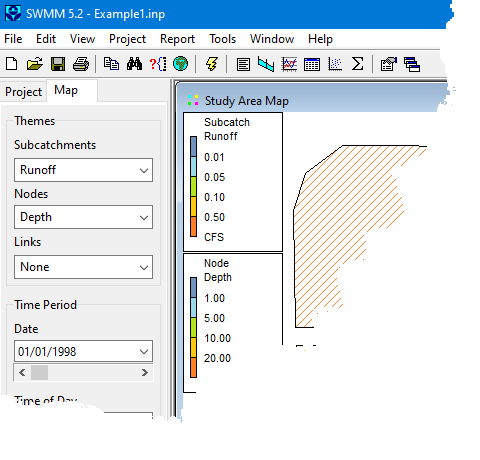

7.2 **Selecting a Map Theme **

A map theme corresponds to a specific layer property whose value is drawn in color-coded fashion on the Study Area Map. The dropdown list boxes on the Map Browser are used for selecting a theme to display for the subcatchment, node and link layers. Methods for changing the color- coding associated with a theme are discussed in Section 7.10 below.

7.3 **Setting the Map’s Dimensions **

The physical dimensions of the map can be defined so that map coordinates can be properly scaled to the computer’s video display. To set the map's dimensions:

**1.** Select **View** >> **Dimensions** from the Main Menu.

**2.** Enter coordinates for the lower-left and upper-right corners of the map into the Map Dimensions dialog (see below) that appears or click the Auto-Size button to automatically set the dimensions based on the coordinates of the objects currently included in the map.