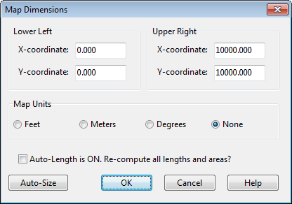
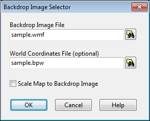

**3.** Select the distance units to use for these coordinates.

**4.** If the **Auto-Length** option is in effect, check the “Re-compute all lengths and areas” box if you would like SWMM to re-calculate all conduit lengths and subcatchment areas under the new set of map dimensions.

**5.** Click the **OK** button to resize the map.

If you are going to use a backdrop image with the automatic distance and area calculation feature, then it is recommended that you set the map dimensions immediately after creating a new project. Map distance units can be different from conduit length units. The latter (feet or meters) depend on whether flow rates are expressed in US or metric units. SWMM will automatically convert from map units if necessary.

If you just want to re-compute conduit lengths and subcatchment areas without changing the map's dimensions, then just check the Re-compute Lengths and Areas box and leave the coordinate boxes as they are.

7.4 **Utilizing a Backdrop Image **

SWMM can display a backdrop image behind the Study Area Map. The backdrop image might be a street map, utility map, topographic map, site development plan, or any other relevant picture or drawing. For example, using a street map would simplify the process of adding sewer lines to the project since one could essentially digitize the drainage system's nodes and links directly on top of it.

The backdrop image must be a Windows metafile, bitmap, JPEG, or PNG image created outside of SWMM. Once imported, its features cannot be edited, although its scale and viewing area will change as the map window is zoomed and panned. For this reason metafiles work better than the other formats since they will not lose resolution when re-scaled. Most CAD and GIS programs have the ability to save their drawings and maps as metafiles. Selecting **View** >> **Backdrop** from the Main Menu will display a sub-menu with the following commands:

- **Load** (loads a backdrop image file into the project)

- **Unload** (unloads the backdrop image from the project)

- **Align** (aligns the drainage system schematic with the backdrop)

- **Resize** (resizes the map dimensions of the backdrop)

- **Watermark** (toggles the backdrop image appearance between normal and lightened) To load a backdrop image select **View** >> **Backdrop** >> **Load** from the Main Menu. A Backdrop Image Selector dialog form will be displayed. The entries on this form are as follows:

Backdrop Image File

Enter the name of the file that contains the image. You can click the button to bring up a standard Windows file selection dialog from which you can search for the image file.

World Coordinates File

If a “world” file exists for the image, enter its name here, or click the button to search for it. A world file contains geo-referencing information for the image and can be created from the software that produced the image file or by using a text editor. It contains six lines with the following information:

Line 1: real world width of a pixel in the horizontal direction.

Line 2: X rotation parameter (not used).

Line 3: Y rotation parameter (not used).

Line 4: negative of the real world height of a pixel in the vertical direction.

Line 5: real world X coordinate of the upper left corner of the image.

Line 6: real world Y coordinate of the upper left corner of the image.

If no world file is specified, then the backdrop will be scaled to fit into the center of the map display window.

Scale Map to Backdrop Image

This option is only available when a world file has been specified. Selecting it forces the dimensions of the Study Area Map to coincide with those of the backdrop image. In addition, all

existing objects on the map will have their coordinates adjusted so that they appear within the new map dimensions yet maintain their relative positions to one another. Selecting this option may then require that the backdrop be re-aligned so that its position relative to the drainage area objects is correct. How to do this is described below. The backdrop image can be re-positioned relative to the drainage system by selecting **View** >> **Backdrop** >> **Align**. This allows the backdrop image to be moved across the drainage system (by moving the mouse with the left button held down) until one decides that it lines up properly. The backdrop image can also be resized by selecting **View** >> **Backdrop** >> **Resize**. In this case a Backdrop Dimensions dialog will appear (see next page). The dialog lets you manually enter the X,Y coordinates of the backdrop’s lower left and upper right corners. The Study Area Map’s dimensions are also displayed for reference. While the dialog is visible you can view map coordinates by moving the mouse over the map window and noting the X,Y values displayed in SWMM’s Status Panel (at the bottom of the main window). Selecting the **Resize Backdrop Image Only** button will resize only the backdrop, and not the Study Area Map, according to the coordinates specified. Selecting the **Scale Backdrop Image to Map** button will position the backdrop image in the center of the Study Area Map and have it resized to fill the display window without changing its aspect ratio. The map's lower left and upper right coordinates will be placed in the data entry fields for the backdrop coordinates, and these fields will become disabled. Selecting **Scale Map to Backdrop Image** makes the dimensions of the map coincide with the dimensions being set for the backdrop image. Note that this option will change the coordinates of all objects currently on the map so that their positions relative to one another remain unchanged. Selecting this option may then require that the backdrop be re-aligned so that its position relative to the drainage area objects is correct.