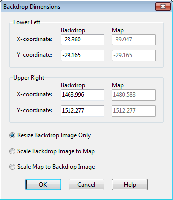

Exercise caution when selecting the **Scale Map to Backdrop Image** option in either the Backdrop Image Selector dialog or the Backdrop Dimensions dialog as it will modify the coordinates of all existing objects currently on the Study Area Map. You might want to save your project before carrying out this step in case the results are not what you expected.

The name of the backdrop image file and its map dimensions are saved along with the rest of a project’s data whenever the project is saved to file.

For best results in using a backdrop image:

- Use a metafile, not a bitmap.

- If the image is loaded before any objects are added to the project then scale the map to it.

7.5 **Measuring Distances **

To measure a distance or area on the Study Area Map: