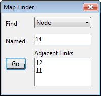

To pan using the Overview Map (which is described in Section 7.11 below):

**1.** If not already visible, bring up the Overview Map by selecting **View** >> **Overview Map**

from the Main Menu or click the button on the Main Toolbar.

**2.** If the Study Area Map has been zoomed in, an outline of the current viewing area will appear on the Overview Map. Position the mouse within this outline on the Overview Map.

**3.** With the left button held down, drag the outline to a new position.

**4.** Release the mouse button and the Study Area Map will be panned to an area corresponding to the outline on the Overview Map.

The mouse wheel can also be use to pan the Study Area Map at any time by holding it down and dragging the mouse in the direction you wish to pan.

7.8 **Viewing at Full Extent **

To view the Study Area Map at full extent, either:

- select **View** >> **Full Extent** from the Main Menu, or

- press on the Map Toolbar.

7.9 **Finding an Object **

To find an object on the Study Area Map whose name is known:

**1.** Select **View >> Find Object** from the Main Menu or click on the Main Toolbar.

**2.** In the Map Finder dialog that appears, select the type of object to find and enter its name.

**3.** Click the **Go** button.

