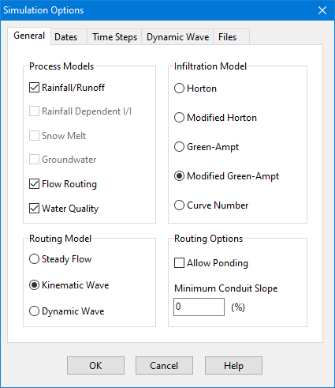
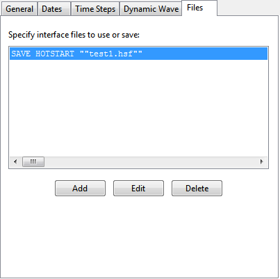

### Chapter 8 **RUNNING A SIMULATION  **

*After a study area has been suitably described, its runoff response, flow routing and water quality * *behavior can be simulated. This section describes how to specify options to be used in the analysis, * *how to run the simulation and how to troubleshoot common problems that might occur. *

8.1 **Setting Simulation Options ** SWMM has a number of options that control how the simulation of a stormwater drainage system is carried out. To set these options:

**1.** Select the Options category from the Project Browser.

**2.** Select one of the following categories of options to edit:

a. General Options

b. Date Options

c. Time Step Options

d. Dynamic Wave Routing Options

e. Interface File Options

f. Reporting Options

g. Event Options

**3.** Click the button on the Browser panel or select **Edit >> Edit Object** to invoke the appropriate editor for the chosen option category (the Simulation Options dialog is used for the first five categories while the Reporting Options dialog and the Events Editor dialog are used, respectively, for the last two). The Simulations Options dialog contains a separate tabbed page for each of the first five option categories listed above. Each page is described in more detail below.

8.1.1 *General Options * The **General** page of the Simulation Options dialog sets values for the following options: **Process Models **

This section selects which of SWMM’s process models will be applied to the current project. For example, a model that contained Aquifer and Groundwater elements could be run first with the groundwater computations turned on and then again with them turned off to see what effect this process had on the site’s hydrology. Note that if there are no elements in the project needed to model a given process then that process option is disabled (e.g., if there were no Aquifers defined for the project then the Groundwater check box will appear disabled in an unchecked state).

**Infiltration Model **

This option selects the default method used to model infiltration of rainfall into the upper soil zone of subcatchments. The choices are:

- Horton

- Modified Horton

- Green-Ampt

- Modified Green-Ampt

- Curve Number

Each of these methods is briefly described in Section 3.4.2. All new subcatchments added to a project will default to using the selected method. For existing subcatchments, their infiltration method will only change if they had been using the previous default option. That would require re-entering values for the infiltration parameters in each such subcatchment, unless the change was between the two Horton options or the two Green-Ampt options. A prompt is issued asking if SWMM should automatically assign a default set of parameter values to all subcatchments that switch between two incompatible types of infiltration methods. Different infiltration models can be used with different subcatchments by editing their **Infiltration** property.

**Routing Model **

This option determines which method is used to route flows through the conveyance system. The choices are:

- Steady Flow

- Kinematic Wave

- Dynamic Wave

Review Section 3.4.5 for a brief description of each of these alternatives.

**Allow Ponding **

Checking this option will allow excess water to collect atop nodes and be re-introduced into the system as conditions permit. In order for ponding to actually occur at a particular node, a non- zero value for its Ponded Area attribute must be used.

**Minimum Conduit Slope **

This is the minimum value allowed for a conduit's slope (%). If blank or zero (the default) then no minimum is imposed (although SWMM uses a lower limit on elevation drop of 0.001 ft (0.00035 m) when computing a conduit slope).

8.1.2 *Date Options * The **Dates** page of the Simulation Options dialog determines the starting and ending dates/times of a simulation. **Start Analysis On  **

Enter the date (month/day/year) and time of day when the simulation begins. **Start Reporting On  **

Enter the date and time of day when reporting of simulation results is to begin. Using a date prior to the start date is the same as using the start date. **End Analysis On  **

Enter the date and time when the simulation is to end. **Start Sweeping On ** Enter the day of the year (month/day) when street sweeping operations begin. The default is January 1. **End Sweeping On **

Enter the day of the year (month/day) when street sweeping operations end. The default is December 31. **Antecedent Dry Days  **

Enter the number of days with no rainfall prior to the start of the simulation. This value is used to compute an initial buildup of pollutant load on the surface of subcatchments.

If rainfall or climate data are read from external files, then the simulation dates should be set to coincide with the dates recorded in these files.

8.1.3 *Time Step Options * The Time Steps page of the Simulation Options dialog establishes the length of the time steps used for runoff computation, routing computation and results reporting. Time steps are specified in days and hours:minutes:seconds except for flow routing which is entered as decimal seconds.

**Reporting Time Step  **

Enter the time interval for reporting of computed results. **Runoff - Wet Weather Time Step  **

Enter the time step length used to compute runoff from subcatchments during periods of rainfall, or when ponded water still remains on the surface, or when LID controls are still infiltrating or evaporating runoff. **Runoff - Dry Weather Time Step  **

Enter the time step length used for runoff computations (consisting essentially of pollutant buildup) during periods when there is no rainfall, no ponded water, and LID controls are dry. This must be greater or equal to the Wet Weather time step. **Control Rule Time Step  **

Enter the time step length used for evaluating Control Rules. The default is 0 which means that controls are evaluated at every routing time step. **Routing Time Step  **

Enter the time step length in decimal seconds used for routing flows and water quality constituents through the conveyance system. Note that Dynamic Wave routing requires a much smaller time step than the other methods of flow routing. **Steady Flow Periods **

This set of options tells SWMM how to identify and treat periods of time when system hydraulics is not changing. The system is considered to be in a steady flow period if:

1. The percent difference between total system inflow and total system outflow is below the **System Flow Tolerance**, 2. The percent differences between the current lateral inflow and that from the previous time step for all points in the conveyance system are below the **Lateral Flow Tolerance**.

Checking the **Skip Steady Flow Periods** box will make SWMM keep using the most recently computed conveyance system flows (instead of computing a new flow solution) whenever the above criteria are met. Using this feature can help speed up simulation run times at the expense of reduced accuracy.

8.1.4 *Dynamic Wave Options *

The Dynamic Wave page of the Simulation Options dialog sets several parameters that control how the dynamic wave flow routing computations are made. These parameters have no effect for the other flow routing methods.

**Inertial Terms  **

Indicates how the inertial terms in the St. Venant momentum equation will be handled.

- **KEEP** maintains these terms at their full value under all conditions.

- **DAMPEN** reduces the terms as flow comes closer to being critical and ignores them when flow is supercritical.

- **IGNORE** drops the terms altogether from the momentum equation, producing what is essentially a Diffusion Wave solution.

**Define Supercritical Flow By **

Selects the basis used to determine when supercritical flow occurs in a conduit. The choices are:

- water surface slope only (i.e., water surface slope > conduit slope)

- Froude number only (i.e., Froude number > 1.0)

- both water surface slope and Froude number.

The first two choices were used in earlier versions of SWMM while the third choice, which checks for either condition, is now the recommended one.

**Force Main Equation **

Selects which equation will be used to compute friction losses during pressurized flow for conduits that have been assigned a Circular Force Main cross-section. The choices are either the **Hazen-** **Williams** equation or the **Darcy-Weisbach** equation.

**Surcharge Method **

Selects which method will be used to handle surcharge conditions. The **Extran** option uses a variation of the Surcharge Algorithm from previous versions of SWMM to update nodal heads when all connecting links become full. The **Slot** option uses a Preissmann Slot to add a small amount of virtual top surface width to full flowing pipes so that SWMM's normal procedure for updating nodal heads can continue to be used.

**Use Variable Time Steps **

Check the box if an internally computed variable time step should be used at each routing time period and select an adjustment (or safety) factor to apply to this time step. The variable time step is computed so as to satisfy the Courant condition within each conduit. A typical adjustment factor would be 75% to provide some margin of conservatism. The computed variable time step will not be less than the minimum variable step discussed below nor be greater than the fixed time step specified on the **Time Steps** page of the dialog.

**Minimum Variable Time Step **

This is the smallest time step allowed when variable time steps are used. The default value is 0.5 seconds. Smaller steps may be warranted, but they can lead to longer simulations runs without much improvement in solution quality. **Time Step for Conduit Lengthening **

This is a time step, in seconds, used to artificially lengthen conduits so that they meet the Courant stability criterion under full-flow conditions (i.e., the travel time of a wave will not be smaller than the specified conduit lengthening time step). As this value is decreased, fewer conduits will require lengthening. A value of zero means that no conduits will be lengthened. The ratio of the artificial length to the original length for each conduit is listed in the Flow Classification table that appears in the simulation’s Summary Report (see Section 9.2). **Minimum Nodal Surface Area **

This is a minimum surface area used at nodes when computing changes in water depth. If 0 is entered, then the default value of 12.566 ft2 (1.167 m2) is used. This is the area of a 4-ft diameter manhole. The value entered should be in square feet for US units or square meters for SI units. **Head Convergence Tolerance **

This is the maximum difference in computed heads between successive trials of SWMM’s iterative method for computing a dynamic wave hydraulic solution that determines when convergence is reached within a given time step. The default tolerance is 0.005 ft (0.0015 m). **Maximum Trials per Time Step **

This is the maximum number of trials that SWMM will use in its iterative method for computing a dynamic wave hydraulic solution within each time step. The default value is 8.

**Number of Parallel Threads to Use **

This selects the number of parallel computing threads to use on machines equipped with multi-

core processors. The default is 1. Clicking the button will display the number of physical cores and logical processors available. Clicking the **Apply Defaults** label will set all the Dynamic Wave options to their default values.

8.1.5 *File Options * The Files page of the Simulation Options dialog is used to specify which interface files will be used or saved during the simulation. (Interface files are described in Chapter 11.) The page contains a list box with three buttons underneath it. The list box lists the currently selected files, while the buttons are used as follows:

**Add** adds a new interface file specification to the list.

**Edit** edits the properties of the currently selected interface file.

**Delete**  deletes the currently selected interface from the project (but not from your hard drive).

