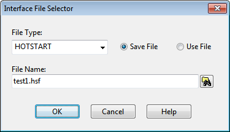
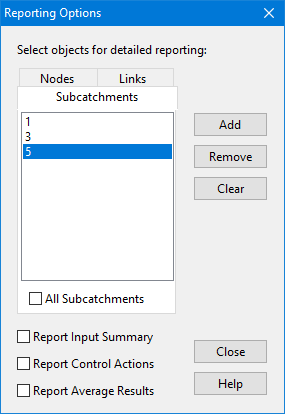

When the **Add** or **Edit** buttons are clicked, an Interface File Selector dialog appears where one can specify the type of interface file, whether it should be used or saved, and its name. The entries on this dialog are as follows:

**File Type **

Select the type of interface file to be specified. **Use / Save Buttons **

Select whether the named interface file will be used to supply input to a simulation run or whether simulation results will be saved to it. **File Name **

Click the Select File button to specify the file name from a standard Windows file selection dialog box.

8.2 **Setting Reporting Options ** The Reporting Options dialog is used to select individual subcatchments, nodes, and links that will have detailed time series results saved for viewing after a simulation has been run. The default for new projects is that all objects will have detailed results saved for them. The dialog is invoked

by selecting the **Reporting** category of Options from the Project Browser and clicking the button (or by selecting **Edit >> Edit Object** from the main menu). The dialog contains three tabbed pages - one each for subcatchments, nodes, and links. It is a stay-on-top form which means that you can select items directly from the Study Area Map or Project Browser while the dialog remains visible.

To include an object in the set that is reported on:

**1.** Select the tab to which the object belongs (**Subcatchments, Nodes** or **Links**).

**2.** Unselect the "**All**" check box if it is currently checked.

**3.** Select the specific object either from the **Study Area Map** or from the listing in the Project Browser.

**4.** Click the **Add** button on the dialog.

**5.** Repeat the above steps for any additional objects.

To remove an item from the set selected for reporting:

**1.** Select the desired item in the dialog's list box.

**2.** Click the **Remove** button to remove the item.

To remove all items from the reporting set of a given object category, select the object category's page and click the **Clear** button.

To include all objects of a given category in the reporting set, check the "**All**" box on the page for that category (i.e., subcatchments, nodes, or links). This will override any individual items that