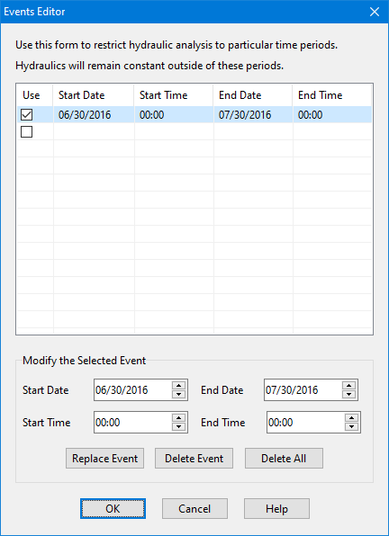

may be currently listed on the page. To dismiss the dialog click the **Close** button. In addition the following reporting options can be selected from this dialog:

**Report Input Summary **

Check this option to have the simulation's Status Report list a summary of the project's input data.

**Report Control Actions **

Check this option to have the simulation's Status Report list all discrete control actions taken by the Control Rules associated with a project (continuous modulated control actions are not listed). This option should only be used for short-term simulation.

**Report Average Results **

Check this option to have the average of the results for all routing time steps that fall within a reporting time step be reported instead of the instantaneous point results that occur at the end of the reporting time step.

8.3 **Selecting Event Periods **

Simulation events allow one to limit the periods of time in which a full unsteady hydraulic analysis of the drainage network is performed. For times outside of these periods, the hydraulic state of the network stays the same as it was at the end of the previous hydraulic event. Although hydraulic calculations are restricted to these pre-defined event periods, a full accounting of the system's hydrology is still computed over the entire simulation duration. During inter-event periods any inflows to the network, from runoff, groundwater flow, dry weather flow, etc., are ignored. The purpose of only computing hydraulics for particular time periods is to speed up long- term continuous simulations where one knows in advance which periods of time (such as representative or critical storm events) are of most interest.

To define a set of simulation events select the **Events** sub-category of Options from the Project

Browser and click the button on the Browser panel or select **Edit >> Edit Object **from the Main Menu. This will bring up the Events Editor in which multiple event time periods can be defined.

The editor consists of a table listing the start and end date of each event, plus a blank line at the end of the list used for adding a new event. The events do not have to be entered in chronological order. There are date and time selection controls below the table used to edit the dates of a selected event. Clicking the **Replace Event** button will replace the row with the entries in these controls. The **Delete Event** button will delete the selected event and the **Delete All** button will delete all events from the table. The first column of the table contains a check box which determines if the event should be used in the analysis or not.

To identify event periods of interest, one can first run a simulation with Flow Routing turned off and then perform a statistical frequency analysis on the system's rainfall record (see Section 9.8 Viewing a Statistics Report).