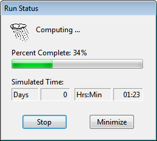

When a new event occurs, the water in a storage unit node will remain at the same level it had at the end of the previous event. Therefore one may want to choose event intervals long enough to minimize the effect that storage carryover might have.

8.4 **Starting a Simulation **

To start a simulation either select **Project** >> **Run Simulation** from the Main Menu or click on the Main Toolbar. A Run Status window will appear which displays the progress of the simulation.

To stop a run before its normal termination, click the **Stop** button on the Run Status window or press the <**Esc**> key. Simulation results up until the time when the run was stopped will be available for viewing. To minimize the SWMM program while a simulation is running, click the **Minimize** button on the Run Status window.

If the analysis runs successfully the icon will appear in the Run Status section of the Status Bar at the bottom of SWMM’s main window. Any error or warning messages will appear in a Status Report window. If you modify the project after a successful run has been made, the status flag

changes to indicating that the current computed results no longer apply to the modified project.

8.5 **Troubleshooting Results ** When a run ends prematurely, the Run Status dialog will indicate the run was unsuccessful and direct the user to the Status Report for details. The Status Report will include an error statement, code, and description of the problem (e.g., ERROR 138: Node TG040 has initial depth greater than maximum depth). Consult Appendix E for a description of SWMM’s error messages. Even if a run