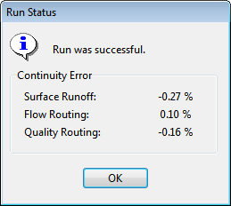

When a new event occurs, the water in a storage unit node will remain at the same level it had at the end of the previous event. Therefore one may want to choose event intervals long enough to minimize the effect that storage carryover might have.

8.4 **Starting a Simulation **

To start a simulation either select **Project** >> **Run Simulation** from the Main Menu or click on the Main Toolbar. A Run Status window will appear which displays the progress of the simulation.

To stop a run before its normal termination, click the **Stop** button on the Run Status window or press the <**Esc**> key. Simulation results up until the time when the run was stopped will be available for viewing. To minimize the SWMM program while a simulation is running, click the **Minimize** button on the Run Status window.

If the analysis runs successfully the icon will appear in the Run Status section of the Status Bar at the bottom of SWMM’s main window. Any error or warning messages will appear in a Status Report window. If you modify the project after a successful run has been made, the status flag

changes to indicating that the current computed results no longer apply to the modified project.

8.5 **Troubleshooting Results ** When a run ends prematurely, the Run Status dialog will indicate the run was unsuccessful and direct the user to the Status Report for details. The Status Report will include an error statement, code, and description of the problem (e.g., ERROR 138: Node TG040 has initial depth greater than maximum depth). Consult Appendix E for a description of SWMM’s error messages. Even if a run

completes successfully, one should check to insure that the results are reasonable. The following are the most common reasons for a run to end prematurely or to contain questionable results. Unknown ID Error Message

This message typically appears when an object references another object that was never defined. An example would be a subcatchment whose outlet was designated as *N29*, but no such subcatchment or node with that name exists. Similar situations can exist for incorrect references made to Curves, Time Series, Time Patterns, Aquifers, Snow Packs, Streets, Inlets, Transects, Pollutants, and Land Uses. File Errors

File errors can occur when:

- a file cannot be located on the user's computer

- a file being used has the wrong format

- a file to be written to cannot be opened because the user does not have write privileges for the directory (folder) where the file is to be stored. Drainage System Layout Errors

A valid drainage system layout must obey the following conditions:

- An outfall node can have only one conduit link connected to it.

- A flow divider node must have exactly two outflow links.

- A node cannot have more than one dummy link connected to it.

- Under Kinematic Wave routing, a junction node can only have one outflow link and a regulator link cannot be the outflow link of a non-storage node.

- Under Dynamic Wave routing there must be at least one outfall node in the network.

An error message will be generated if any of these conditions are violated. Excessive Continuity Errors

When a run completes successfully, the mass continuity errors for runoff, flow routing, and pollutant routing will be displayed in the Run Status window. These errors represent the percent difference between initial storage + total inflow and final storage + total outflow for the entire drainage system. If they exceed some reasonable level, such as 10 percent, then the validity of the analysis results must be questioned. The most common reasons for an excessive continuity error are computational time steps that are too long or conduits that are too short.

In addition to the system continuity error, the Status Report produced by a run (see Section 9.1) will list those nodes of the drainage network that have the largest flow continuity errors. If the error for a node is excessive, then one should first consider if the node in question is of importance to the purpose of the simulation. If it is, then further study is warranted to determine how the error might be reduced. Unstable Flow Routing Results

Due to the explicit nature of the numerical methods used for Dynamic Wave routing (and to a lesser extent, Kinematic Wave routing), the flows in some links or water depths at some nodes may fluctuate or oscillate significantly at certain periods of time as a result of numerical instabilities in the solution method. SWMM does not automatically identify when such conditions exist, so it is up to the user to verify the numerical stability of the model and to determine if the simulation results are valid for the modeling objectives. Time series plots at key locations in the network can help identify such situations as can a scatter plot between a link’s flow and the corresponding water depth at its upstream node (see Section 9.5, Viewing Results with a Graph). Numerical instabilities can occur over short durations and may not be apparent when time series are plotted with a long time interval. When detecting such instabilities, it is recommended that a reporting time step of 1 minute or less be used, at least for an initial screening of results. The run’s Status Report lists the links having the five highest values of a Flow Instability Index (FII). This index counts the number of times that the flow value in a link is higher (or lower) than the flow in both the previous and subsequent time periods. The index is normalized with respect to the expected number of such ‘turns’ that would occur for a purely random series of values and can range from 0 to 150. As an example of how the Flow Instability Index can be used, consider Figure 8-1. The solid line plots the flow hydrograph for the link identified as having the highest FII value (100) in a dynamic

wave flow routing run that used a fixed time step of 30 seconds. The dashed line shows the hydrograph that results when a variable time step was used instead, which is now completely stable.

Fixed Time Step (FII = 100)

Variable Time Step (FII = 0)

Flow (cfs)

0 2 4 6 8 10 12

Time (hours)

**Figure 8-1  Flow Instability Index for a flow hydrograph **

Flow time series plots for the links having the highest FII’s should be inspected to insure that flow routing results are acceptably stable. Numerical instabilities under Dynamic Wave flow routing can be reduced by:

- reducing the routing time step

- utilizing the variable time step option with a smaller time step factor

- selecting to ignore the inertial terms of the momentum equation

- selecting the option to lengthen short conduits.