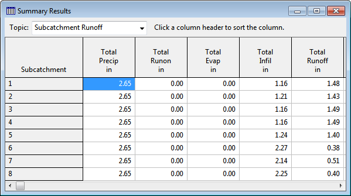

To save both the entire Status Report and Summary Report (discussed next) to file, select **File >> ** **Export >> Status/Summary Report** from the Main Menu.

9.2 **Viewing Summary Results ** SWMM's Summary Results report lists summary results for each subcatchment, node, and link in the project through a selectable list of tables. To view the various summary results tables, select

**Report >> Summary** from the Main Menu or click the button on the Main Toolbar and select **Summary Results** from the drop-down menu that appears. The Summary Results window looks as follows:

The drop-down box at the upper left allows you to choose the type of results to view. The selection of tables and the results they display are as follows (items marked with an asterisk can also be viewed as color coded themes on the Study Area Map by selecting them from the Map Browser – see Section 7.1):

**Table ** **Columns **

Subcatchment Runoff Total precipitation (in or mm) Total run-on from other subcatchments (in or mm) Total evaporation (in or mm) Total infiltration (in or mm) Total runoff depth from impervious areas (in or mm) Total runoff depth from pervious areas (in or mm) Total runoff depth (in or mm) Total runoff volume (million gallons or million liters) Peak runoff (flow units) Runoff coefficient (ratio of total runoff to total precipitation)

LID Performance Total inflow volume Total evaporation loss Total infiltration loss Total surface outflow Total underdrain outflow Initial storage volume Final storage volume Flow continuity error (%)

*over the LID *

*Note: all quantities are expressed as depths (in or mm) * *unit’s surface area. *

Groundwater Summary Total surface infiltration (in or mm) Total evaporation (in or mm) Total lower seepage (in or mm) Total lateral outflow (in or mm) Maximum lateral outflow (flow units) Average upper zone moisture content (volume fraction) Average water table elevation (ft or m) Final upper zone moisture content (volume fraction) Final water table elevation (ft or m)

Subcatchment Washoff Total mass of each pollutant washed off the subcatchment (lbs or kg)

Node Depth

Average water depth (ft or m) Maximum water depth (ft or m) Maximum hydraulic head (HGL) (ft or m) Time of maximum depth Maximum water depth at reporting times (ft or m)

Node Inflow Maximum lateral inflow (flow units) Maximum total inflow (flow units) Time of maximum total inflow Total lateral inflow volume (million gallons or million liters) Total inflow volume (million gallons or million liters) Flow balance error (%)

*Note: Total inflow consists of lateral inflow plus inflow from * *connecting links. *

Node Surcharge Hours surcharged Maximum height of surcharge above node’s crown (ft or m) Minimum depth of surcharge below node’s top rim (ft or m)

*Note: surcharging occurs when water rises above the crown of the * *highest conduit and only those conduits that surcharge are listed. *

Node Flooding Hours flooded** ** Maximum flooding rate (flow units) Time of maximum flooding Total flood volume (million gallons or million liters) Peak depth (for dynamic wave routing in ft or m) or peak volume (1000 ft3 or 1000 m3) of ponded surface water

*Note: flooding refers to all water that overflows a node, whether it * *ponds or not, and only those nodes that flood are listed. *

Storage Volume Average volume of water in the facility (1000 ft3 or 1000 m3) Average percent of full storage capacity utilized Percent of total stored volume lost to evaporation Percent of total stored volume lost to seepage Maximum volume of water in the facility (1000 ft3 or 1000 m3) Maximum  percent of full storage capacity utilized Time of maximum water stored Maximum outflow rate from the facility (flow units)

Outfall Loading Percent of time that outfall discharges Average discharge flow (flow units) Maximum discharge flow (flow units) Total volume of flow discharged (million gallons or million liters) Total mass discharged of each pollutant (lbs or kg)

Street Flow

(Street Conduits Only)

Peak flow (flow units) Maximum spread from curb (ft or m) Maximum depth at curb (ft or m) For streets with assigned inlets

- name of inlet structure  inlet location (on-grade or on-sag)  peak flow capture efficiency (%)  average flow capture efficiency (%)  frequency of bypass flow (%)  frequency of backflow (%)

Link Flow Maximum flow (flow units) Time of maximum flow Maximum velocity (ft/sec or m/sec) Ratio of maximum flow to full normal flow Ratio of maximum flow depth to full depth** **

Flow Classification

Ratio of adjusted conduit length to actual length Fraction of all time steps spent in the following flow categories:

(Dynamic Wave Routing Only)

- dry on both ends  dry on the upstream end  dry on the downstream end  subcritical flow  supercritical flow  critical flow at the upstream end  critical flow at the downstream end Fraction of all time steps flow is limited to normal flow Fraction of all time steps flow is inlet controlled (for culverts only)

Conduit Surcharge Hours that conduit is full at:

- both ends  upstream end  downstream end Hours that conduit flows above full normal flow Hours that conduit is capacity limited** **