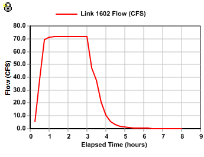
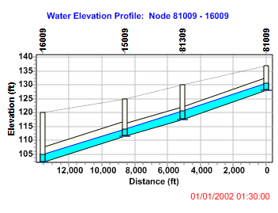
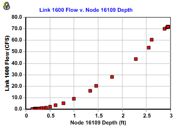
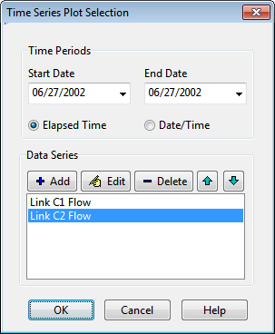
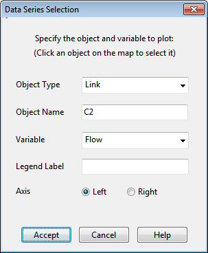
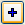
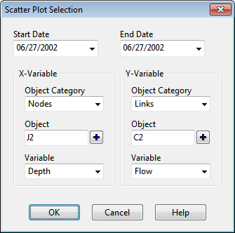

9.4 **Viewing Results on the Map **

There are several ways to view the values of certain input parameters and simulation results directly on the Study Area Map:

- For the current settings on the Map Browser, the subcatchments, nodes and links of the map will be colored according to their respective Map Legends. The map's color coding will be updated as a new time period is selected in the Map Browser.

- When the Flyover Map Labeling program preference is selected (see Section 4.10), moving the mouse over any map object will display its ID name and the value of its current theme parameter in a hint-style box.

- ID names and parameter values can be displayed next to all subcatchments, nodes and/or links by selecting the appropriate options on the Annotation page of the Map Options dialog (see Section 7.12).

- Subcatchments, nodes or links meeting a specific criterion can be identified by submitting a Map Query (see Section 7.9).

- One can animate the display of results on the network map either forward or backward in time by using the controls on the Animator panel of the Map Browser (see Section 4.8).

- The map can be printed, copied to the Windows clipboard, or saved as a DXF file or Windows metafile (see Section 7.13).

9.5 **Viewing Results with a Graph **

Analysis results can be viewed using several different types of graphs. Graphs can be printed, copied to the Windows clipboard, or saved to a text file or to a Windows metafile. The following types of graphs can be created from available simulation results:

- Time Series Plot:

- Profile Plot:

- Scatter Plot:

You can zoom in or out of any graph by holding down the <**Shift**> key while drawing a zoom rectangle with the mouse's left button held down. Drawing the rectangle from left to right zooms in, drawing it from right to left zooms out. The plot can also be panned in any direction by moving the mouse across the plot with the left button held down An opened graph will normally be redrawn when a new simulation is run. To prevent the automatic updating of a graph once a new set of results is computed you can lock the current

graph by clicking the icon in the upper left corner of the graph. To unlock the graph, click the icon again.

9.5.1 *Time Series Plots  * A Time Series Plot graphs the values over time of specific combinations of objects and variables. Up to six time series can be plotted on the same graph. When only a single time series is plotted, and that item has calibration data registered for the plotted variable, then the calibration data will be plotted along with the simulated results (see Section 5.7.2 for instructions on how to register calibration data with a project). To create a Time Series Plot, select **Report** >> **Graph** >> **Time Series** from the Main Menu or click

on the Main Toolbar. A Time Series Plot Selection dialog will appear. Use it to describe what objects and quantities should be plotted.

The Time Series Plot Selection dialog selects a set of objects and their variables whose computed time series will be graphed in a Time Series Plot. The dialog is used as follows:

**1.** Select a Start Date and End Date for the plot (the default is the entire simulation period).

**2.** Choose whether to show time as Elapsed Time or as Date/Time values.

**3.** Add up to six different data series to the plot by clicking the **Add** button above the data series list box.

**4.** Use the **Edit** button to make changes to a selected data series or the **Delete** button to delete a data series.

**5.** Use the **Up** and **Down** buttons to change the order in which the data series will be plotted.

**6.** Click the **OK** button to create the plot. When you click the **Add** or **Edit** buttons a Data Series Selection dialog will be displayed for selecting a particular object and variable to plot. It contains the following data fields:

**Object Type**: The type of object to plot (Subcatchment, Node, Link or System).

**Object Name**: The ID name of the object to be plotted. (This field is disabled for System variables).

**Variable:** The variable whose time series will be plotted (choices vary by object type).

**Legend Label**: The text to use in the legend for the data series. If left blank, a default label made up of the object type, name, variable and units will be used (e.g. Link C16 Flow (CFS)).

**Axis**: Whether to use the left or right vertical axis to plot the data series.

As you select objects on the Study Area Map or in the Project Browser their types and ID names will automatically appear in this dialog.

Click the **Accept** button to add/update the data series into the plot or click the **Cancel** button to disregard your edits. You will then be returned to the Time Series Plot Selection dialog where you can add or edit another data series.

To make a precipitation time series display in inverted fashion on a plot, assign it to the right axis and after the plot is displayed, use the Graph Options Dialog (see Section 9.6) to invert the right axis and expand the scales of both the left and right axes (so it doesn't overlap another data series).

9.5.2 *Profile Plots *

A Profile Plot displays the variation in simulated water depth with distance over a connected path of drainage system links and nodes at a particular point in time. Once the plot has been created it will be automatically updated as a new time period is selected using the Map Browser.

To create a Profile Plot:

**1.** Select **Report** >> **Graph** >> **Profile** from the main menu or press on the Main Toolbar

**2.** A Profile Plot Selection dialog will appear (see below). Use it to identify the path along which the profile plot is to be drawn.

The Profile Plot Selection dialog is used to select a path of connected conveyance system links along which a water depth profile versus distance should be drawn. To define a path using the dialog:

**1.** Enter the ID of the upstream node of the first link in the path in the Start Node edit field

(or click on the node on the Study Area Map and then on the button next to the edit field).

**2.** Enter the ID of the downstream node of the last link in the path in the End Node edit field

(or click the node on the map and then click the button next to the edit field).

**3.** Click the **Find Path** button to have the program automatically identify the path with the smallest number of links between the start and end nodes. These will be listed in the Links in Profile box.

**4.** You can insert a new link into the Links in Profile list by selecting the new link either on

the Study Area Map or in the Project Browser and then clicking the button underneath the Links in Profile list box.

**5.** Entries in the Links in Profile list can be deleted or rearranged by using the , ,

and buttons underneath the list box.

**6.** Click the **OK** button to view the profile plot.

To save the current set of links listed in the dialog for future use:

**1.** Click the **Save Current Profile** button.

**2.** Supply a name for the profile when prompted.

To use a previously saved profile:

**1.** Click the **Use Saved Profile** button.

**2.** Select the profile to use from the Profile Selection dialog that appears.

Profile plots can also be created before any simulation results are available, to help visualize and verify the vertical layout of a drainage system. Plots created in this manner will contain a refresh

button in the upper left corner that can be used to redraw the plot after edits are made to any elevation data appearing in the plot.

9.5.3 *Scatter Plots *

A Scatter Plot displays the relationship between a pair of variables, such as flow rate in a pipe versus water depth at a node. To create a Scatter Plot, select **Report** >> **Graph** >> **Scatter** from

the main menu or press on the Main Toolbar. Then use the Scatter Plot Selection dialog that appears (see below) to specify what time interval and what pair of objects and their variables to plot using the.

