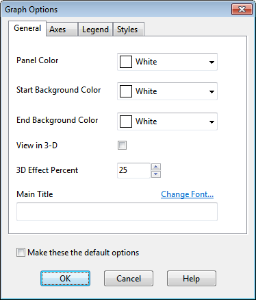
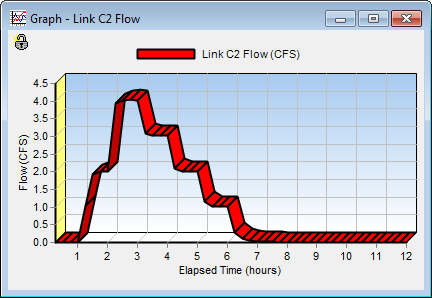
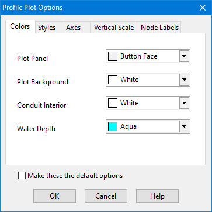

The Scatter Plot Selection dialog is used to select the objects and variables to be graphed against one another in a scatter plot. Use the dialog as follows:

**1.** Select a Start Date and End Date for the plot (the default is the entire simulation period).

**2.** Select the following choices for the X-variable (the quantity plotted along the horizontal axis):

a. Object Category (Subcatchment, Node or Link)

b. Object ID (enter a value or click on the object either on the Study Area Map or in

the Project Browser and then click the button on the dialog)

c. Variable to plot (choices depend on the category of object selected).

**3.** Do the same for the Y-variable (the quantity plotted along the vertical axis).

**4.** Click the **OK** button to create the plot.

9.6 **Customizing a Graph’s Appearance ** To customize the appearance of a graph:

**1.** Make the graph the active window (click on its title bar).

**2.** Select **Report** >> **Customize** from the Main Menu, or click on the Main Toolbar, or right-click on the graph.

**3.** Use the Graph Options dialog that appears to customize the appearance of a Time Series or Scatter Plot, or use the Profile Plot Options dialog for a Profile Plot. The Graph Options dialog is used to customize the appearance of a time series plot, a scatter plot, or a frequency plot (described in Section9.8). To use the dialog:

**1.** Select from among the four tabbed pages that cover the following categories of options: General, Axes, Legend, and Styles.

**2.** Check the **Default** box to use the current settings as defaults for all new graphs as well.

**3.** Select **OK** to accept your selections.

9.6.1 *Graph Options - General * The following options can be set on the General page of the Graph Options dialog box:

*Panel Color * Color of the panel that contains the graph

Starting gradient color of graph's plotting area

*Start Background * *Color *

Ending gradient color of graph’s plotting area

*End Background * *Color *

*View in 3D * Check if graph should be drawn in 3D

*3D Effect Percent * Degree to which 3D effect is drawn

*Main Title * Text of graph's main title

*Font * Click to set the font used for the main title

The figure below shows a 3D graph with White as the *Start Background Color *and Sky Blue as the *End Background Color*.

9.6.2 *Graph Options - Axes * The Axes page of the Graph Options dialog box adjust the way that the axes are drawn on a graph. One first selects an axis (Bottom, Left or Right (if present)) to work with and then selects from the following options:

*Gridlines * Displays grid lines on the graph.

*Inverted * Inverts the scale of the right vertical axis.

*Auto Scale * Fills in the Minimum, Maximum and Increment boxes with an automatic axis scaling.

*Minimum * Sets the minimum axis value (the minimum data value is shown in parentheses). Can be left blank.

*Maximum * Sets the maximum axis value (the maximum data value is shown in parentheses). Can be left blank.

*Increment * Sets the increment between axis labels. If left blank or set to zero the program will automatically select an increment.

*Axis Title * Text of axis title.

*Font * Click to select a font for the axis title.

9.6.3 *Graph Options - Legend * The Legend page of the Graph Options dialog box controls how the legend is displayed on the graph.

*Position * Selects where to place the legend.

*Color * Selects color to use for legend background.

*Check Boxes * If selected, check boxes will appear next to each legend entry, allowing one to make the data series visible or invisible on the graph.

*Framed * Places a frame around the legend.

*Shadowed * Places a shadow behind the legend’s text.

*Transparent * Makes the legend background transparent.

*Visible * Makes the legend visible.

*Symbol Width * Selects the width used to draw the symbol portion of a legend item, as a percentage of the length of the longest legend label.

9.6.4 *Graph Options - Styles * The Styles page of the Graph Options dialog box controls how individual data series (or curves) are displayed on a graph. To use this page:

**1.** Select a data series to work with from the **Series** combo box.

**2.** Edit the title used to identify this series in the legend.

**3.** Click the **Font** button to change the font used for the legend. (Other legend properties are selected on the **Legend** page of the dialog.)

**4.** Select a property of the data series you would like to modify (not all properties are available for some types of graphs). The choices are:

- Lines  Markers  Patterns  Labels

9.6.5 *Profile Plot Options Dialog * The Profile Plot Options dialog is used to customize the appearance of a Profile Plot. The dialog contains five pages:

*Colors: *

- Selects the color to use for the plot window panel, the plot background, a conduit’s interior, and the depth of filled water.

*Styles: *

- Selects to use thick lines or not when drawing conduits and the ground profile.

- Selects to display the ground profile or not.

- Includes a "Display Conduits Only" check box that provides a closer look at the water levels within conduits by removing all other details from the plot.

*Axes: *

- Edits the main and axis titles, including their fonts.

- Selects to display horizontal and vertical axis grid lines.