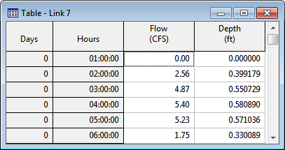
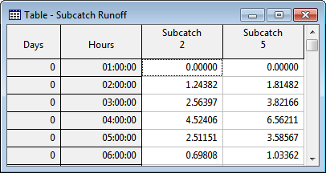
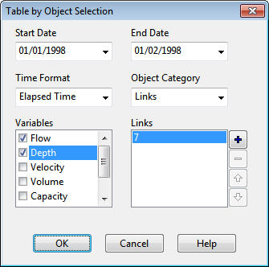
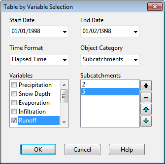

*Vertical Scale: *

- Lets one choose the minimum, maximum, and increment values for the vertical axis scale, or have SWMM set the scale automatically. If the increment field contains 0 or is left blank the program will automatically select an increment to use.

*Node Labels: *

- Selects to display node ID labels either along the plot’s top axis, directly on the plot above the node’s crown height, or both.

- Selects the length of arrow to draw between the node label and the node’s crown on the plot (use 0 for no arrows).

- Selects the font size of the node ID labels.

Check the **Default** box to have these options (except the Vertical Scale) apply to all new profile plots when they are first created.

9.7 **Viewing Results with a Table **

Time series results for selected variables and objects can also be viewed in a tabular format. There are two types of formats available:

- Table by Object - tabulates the time series of several variables for a single object (e.g., flow and water depth for a conduit).

- Table by Variable - tabulates the time series of a single variable for several objects of the same type (e.g., runoff for a group of subcatchments).

To create a tabular report:

**1.** Select **Report** >> **Table** from the Main Menu or click on the Main Toolbar.

**2.** Choose the table format (either **By Object** or **By Variable**) from the sub-menu that appears.

**3.** Fill in the Table by Object or Table by Variable dialogs to specify what information the table should contain. The Table by Object dialog is used when creating a time series table of several variables for a single object. Use the dialog as follows:

**1.** Select a Start Date and End Date for the table (the default is the entire simulation period).

**2.** Choose whether to show time as Elapsed Time or as Date/Time values.

**3.** Choose an Object Category (Subcatchment, Node, Link, or System).

**4.** Identify a specific object in the category by clicking the object either on the Study Area

Map or in the Project Browser and then clicking the button on the dialog. Only a single object can be selected for this type of table.

**5.** Check off the variables to be tabulated for the selected object. The available choices depend on the category of object selected.

**6.** Click the **OK** button to create the table.

The Table by Variable dialog is used when creating a time series table of a single variable for one or more objects. Use the dialog as follows:

**1.** Select a Start Date and End Date for the table (the default is the entire simulation period).

**2.** Choose whether to show time as Elapsed Time or as Date/Time values.

**3.** Choose an Object Category (Subcatchment, Node or Link).

**4.** Select a simulated variable to be tabulated. The available choices depend on the category of object selected.