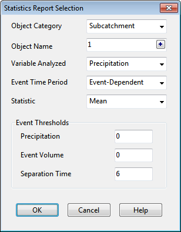
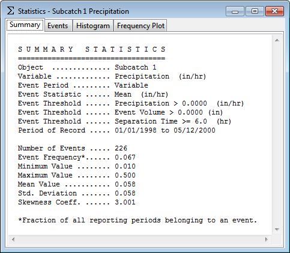

**5.** Identify one or more objects in the category by successively clicking the object either on

the Study Area Map or in the Project Browser and then clicking the button on the dialog.

**6.** Click the **OK** button to create the table. Objects already selected can be deleted, moved up in the order or moved down in the order by

clicking the , , and buttons, respectively.

9.8 **Viewing a Statistics Report ** A Statistics Report can be generated from the time series of simulation results. For a given object and variable this report will do the following:

- segregate the simulation period into a sequence of non-overlapping events, either by day, month, or by flow (or volume) above some minimum threshold value,

- compute a statistical value that characterizes each event, such as the mean, maximum, or total sum of the variable over the event's time period,

- compute summary statistics for the entire set of event values (mean, standard deviation and skewness),

- perform a frequency analysis on the set of event values.

The frequency analysis of event values will determine the frequency at which a particular event value has occurred and will also estimate a return period for each event value. Statistical analyses of this nature are most suitable for long-term continuous simulation runs. To generate a Statistics Report:

**1.** Select **Report** >> **Statistics** from the Main Menu or click on the Main Toolbar.

**2.** Fill in the Statistics Report Selection dialog that appears, specifying the object, variable, and event definition to be analyzed.

**Object Category **

Select the category of object to analyze (Subcatchment, Node, Link or System). **Object Name **

Enter the ID name of the object to analyze. Instead of typing in an ID name, you can select the

object on the Study Area Map or in the Project Browser and then click the button to select it into the Object Name field. **Variable Analyzed **

Select the variable to be analyzed. The available choices depend on the object category selected (e.g., rainfall, losses, or runoff for subcatchments; depth, inflow, or flooding for nodes; depth, flow, velocity, or capacity for links; water quality for all categories). **Event Time Period **

Select the length of the time period that defines an event. The choices are daily, monthly, or event-dependent. In the latter case, the event period depends on the number of consecutive reporting periods where simulation results are above the threshold values defined below.

**Statistic **

Choose an event statistic to be analyzed. The available choices depend on the choice of variable to be analyzed and include such quantities as mean value, peak value, event total, event duration, and inter-event time (i.e., the time interval between the midpoints of successive events). For water quality variables the choices include mean concentration, peak concentration, mean loading, peak loading, and event total load.

**Event Thresholds **

These define minimum values that must be exceeded for an event to occur:

- The Analysis Variable threshold specifies the minimum value of the variable being analyzed that must be exceeded for a time period to be included in an event.

- The Event Volume threshold specifies a minimum flow volume (or rainfall volume) that must be exceeded for a result to be counted as part of an event.

- Separation Time sets the minimum number of hours that must occur between the end of one event and the start of the next event. Events with fewer hours are combined together. This value applies only to event-dependent time periods (not to daily or monthly event periods).

If a particular type of threshold does not apply, then leave the field blank.

After the choices made on the Statistics Selection dialog form are processed, a Statistics Report is produced as shown below. It consists of four tabbed pages that contain:

- a table of event summary statistics

- a table of rank-ordered event periods, including their date, duration, and magnitude

- a histogram plot of the chosen event statistic

- an exceedance frequency plot of the event values.

The exceedance frequencies included in the Statistics Report are computed with respect to the number of events that occur, not the total number of reporting periods.

