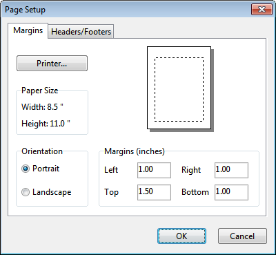

### Chapter 10 **PRINTING AND COPYING **

*This chapter describes how to print, copy to the Windows clipboard, or copy to file the contents of * *the currently active window in the SWMM workspace. This can include the study area map, a * *graph, a table, or a report. *

10.1 **Selecting a Printer ** To select a printer from among your installed Windows printers and set its properties:

**1.** Select **File** >> **Page Setup** from the Main Menu.

**2.** Click the **Printer** button on the Page Setup dialog that appears (see below).

**3.** Select a printer from the choices available in the combo box in the Print Setup dialog that appears.

**4.** Click the **Properties** button to select the appropriate printer properties (which vary with choice of printer).

**5.** Click **OK** on each dialog to accept your selections.

