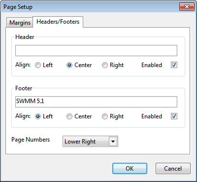

10.2 **Setting the Page Format **

To format the printed page:

**1.** Select **File** >> **Page Setup** from the main menu.

**2.** Use the Margins page of the Page Setup dialog form that appears (see below) to:

- Select a printer.

- Select the paper orientation (Portrait or Landscape).

- Set left, right, top, and bottom margins.

**3.** Use the Headers/Footers page of the dialog box (see below) to:

- Supply the text for a header that will appear on each page.

- Indicate whether the header should be printed or not and how its text should be aligned.

- Supply the text for a footer that will appear on each page.

- Indicate whether the footer should be printed or not and how its text should be aligned.

- Indicate whether pages should be numbered.

**4.** Click **OK** to accept your choices.

