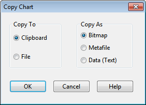

10.3 **Print Preview ** To preview a printout select **File** >> **Print Preview** from the Main Menu. A Preview form will appear which shows how each page being printed will appear. While in preview mode, the left mouse button will re-center and zoom in on the image and the right mouse button will re-center and zoom out.

10.4 **Printing the Current View ** To print the contents of the current window being viewed in the SWMM workspace, either select

**File >> Print** from the Main Menu or click on the Main Toolbar. The following views can be printed:

- Study Area Map (at the current zoom level)

- Status Report.

- Summary report (for the current table being viewed)

- Graphs (Time Series, Profile, and Scatter plots)

- Tabular Reports

- Statistical Reports.

10.5 **Copying to the Clipboard or to a File ** SWMM can copy the text and graphics of the current window being viewed to the Windows clipboard or to a file. Views that can be copied in this fashion include the Study Area Map, summary report tables, graphs, time series tables, and statistical reports. To copy the current view to the clipboard or to file:

**1.** If the current view is a time series table, select the cells of the table to copy by dragging the mouse over them or copy the entire table by selecting **Edit** >> **Select All** from the Main Menu.

**2.** Select **Edit** >> **Copy To** from the Main Menu or click the button on the Main Toolbar.

**3.** Select choices from the Copy dialog that appears (see below) and click the **OK** button.

**4.** If copying to file, enter the name of the file in the **Save As** dialog that appears and click **OK**.

Use the Copy dialog as follows to define how you want your data copied and to where:

**1.** Select a destination for the material being copied (**Clipboard** or **File**)

**2.** Select a format to copy in:

- **Bitmap** (graphics only)

- **Metafile** (graphics only)

- **Data** (text, selected cells in a table, or data used to construct a graph)

**3.** Click **OK** to accept your selections or **Cancel** to cancel the copy request.

The bitmap format copies the individual pixels of a graphic. The metafile format copies the instructions used to create the graphic and is more suitable for pasting into word processing documents where the graphic can be re-scaled without losing resolution. When data is copied, it can be pasted directly into a spreadsheet program to create customized tables or charts.