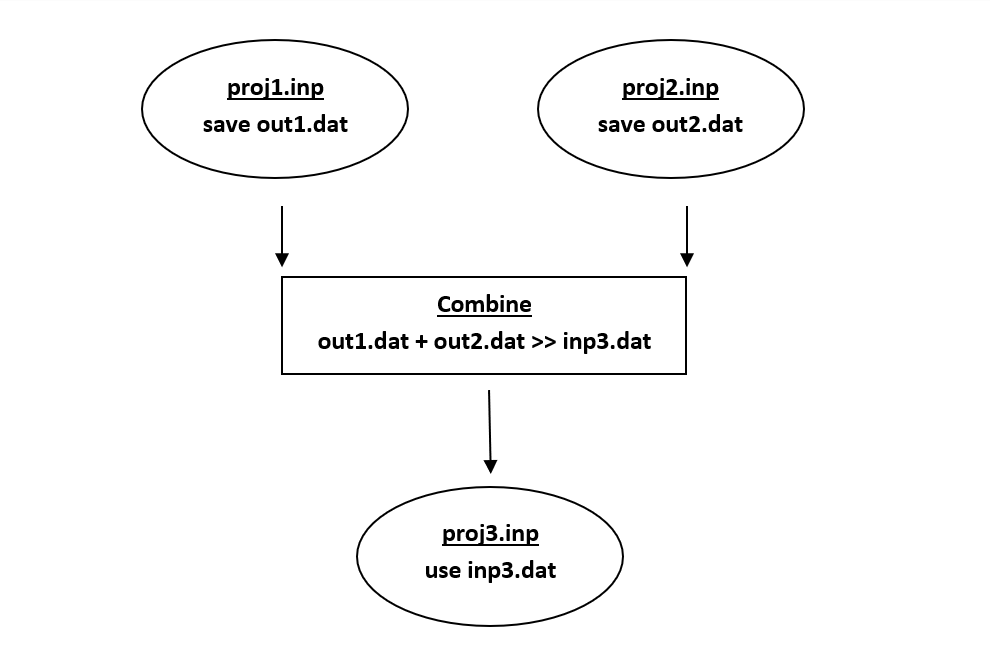

;Rainfall Data for Gage G1 07/01/2003  00:00 0.00000 00:15 0.03200 00:30 0.04800 00:45 0.02400 01:00 0.0100 07/06/2003  14:30 0.05100 14:45 0.04800 15:00 0.03000 18:15 0.01000 18:30 0.00800

In earlier releases of SWMM 5, a time series file was required to have two header lines of descriptive text at the start of the file that did not have to begin with the semicolon comment character. These files can still be used as long as they are modified by inserting a semicolon at the front of the first two lines.

When preparing rainfall time series files, it is only necessary to enter periods with non- zero rainfall amounts. SWMM interprets the rainfall value as a constant value lasting over the recording interval specified for the rain gage which utilizes the time series. For all other types of time series, SWMM uses interpolation to estimate values at times that fall in between the recorded values.

11.7 **Interface Files ** SWMM can use several different kinds of interface files that contain either externally imposed inputs (e.g., rainfall or RDII hydrographs) or the results of previously run analyses (e.g., runoff or routing results). These files can help speed up simulations, simplify comparisons of different loading scenarios, and allow large study areas to be broken up into smaller areas that can be analyzed individually. The different types of interface files that are currently available include:

- rainfall interface file

- runoff interface file

- hot start file

- RDII interface file

- routing interface files

Consult Section 8.1 for instructions on how to specify interface files for use as input and/or output in a simulation.

11.7.1 *Rainfall and Runoff Files * The rainfall and runoff interface files are binary files created internally by SWMM that can be saved and reused from one analysis to the next. The rainfall interface file collates a series of separate rain gage files into a single rainfall data file. Normally a temporary file of this type is created for every SWMM analysis that uses external rainfall data files and is then deleted after the analysis is completed. However, if the same rainfall data are being used with many different analyses, requesting SWMM to save the rainfall interface file after the first run and then reusing this file in subsequent runs can save computation time.

The rainfall interface file should not be confused with a rainfall data file. The latter is an external text file that provides rainfall time series data for a single rain gage. The former is a binary file created internally by SWMM that processes all of the rainfall data files used by a project. The runoff interface file can be used to save the runoff results generated from a simulation run. If runoff is not affected in future runs, the user can request that SWMM use this interface file to supply runoff results without having to repeat the runoff calculations again.

11.7.2 *Hot Start Files * Hot start files are binary files created by SWMM that contain the full hydrologic, hydraulic and water quality state of the study area at the end of a run. The following information is saved to the file:

- the ponded depth and its water quality for each subcatchment

- the pollutant mass buildup on each subcatchment

- the infiltration state of each subcatchment

- the conditions of any snow pack on each subcatchment

- the unsaturated zone moisture content, water table elevation, and groundwater outflow for each subcatchment that has a groundwater zone defined for it

- the water depth, lateral inflow, and water quality at each node of the system

- the flow rate, water depth, control setting and water quality in each link of the system.

The hydrologic state of any LID units is not saved. The hot start file saved after a run can be used to define the initial conditions for a subsequent run. Hot start files can be used to avoid the initial numerical instabilities that sometimes occur under Dynamic Wave routing. For this purpose they are typically generated by imposing a constant set of base flows (for a natural channel network) or set of dry weather sanitary flows (for a sewer network) over some startup period of time. The resulting hot start file from this run is then used to initialize a subsequent run where the inflows of real interest are imposed. It is also possible to both use and save a hot start file in a single run, starting off the run with one file and saving the ending results to another. The resulting file can then serve as the initial conditions for a subsequent run if need be. This technique can be used to divide up extremely long continuous simulations into more manageable pieces. Instructions to save and/or use a hot start file can be issued when editing the Interface Files options available in the Project Browser (see Section 8.1, Setting Simulation Options). One can also use the **File >> Export >> Hot Start File** Main Menu command to save the results of a current run at any particular time period to a hot start file. However, in this case only the results for nodes, links and groundwater elevation will be saved.

11.7.3 *RDII Files * The RDII interface file contains a time series of rainfall-dependent infiltration and inflow flows for a specified set of drainage system nodes. This file can be generated from a previous SWMM run when Unit Hydrographs and nodal RDII inflow data have been defined for the project, or it can be created outside of SWMM using some other source of RDII data (e.g., through measurements or output from a different computer program). RDII files generated by SWMM are saved in a binary format. RDII files created outside of SWMM are text files with the same format used for routing interface files discussed below, where Flow is the only variable contained in the file.

11.7.4 *Routing Files * A routing interface file stores a time series of flows and pollutant concentrations that are discharged from the outfall nodes of drainage system model. This file can serve as the source of inflow to another drainage system model that is connected at the outfalls of the first system. A Combine utility is available on the **File** menu that will combine pairs of routing interface files into a single interface file. This allows very large systems to be broken into smaller sub-systems that can be analyzed separately and linked together through the routing interface file. Figure 11.1 below illustrates this concept.

**Figure 11-1  Combining routing interface files **

A single SWMM run can utilize an outflows routing file to save results generated at a system's outfalls, an inflows routing file to supply hydrograph and pollutograph inflows at selected nodes, or both.

11.7.5 *RDII / Routing File Format *

RDII interface files and routing interface files have the same text format:

**1.** the first line contains the keyword "SWMM5" (without the quotes)

**2.** a line of text that describes the file (can be blank)

**3.** the time step used for all inflow records (integer seconds)

**4.** the number of variables stored in the file, where the first variable must always be flow rate

**5.** the name and units of each variable (one per line), where flow rate is the first variable listed and is always named FLOW

**6.** the number of nodes with recorded inflow data

**7.** the name of each node (one per line)

**8.** a line of text that provides column headings for the data to follow (can be blank)

**9.** for each node at each time step, a line with:

- the name of the node

- the date (year, month, and day separated by spaces)

- the time of day (hours, minutes, and seconds separated by spaces)

- the flow rate followed by the concentration of each quality constituent

Time periods with no values at any node can be skipped. An excerpt from an RDII / routing interface file is shown below.

SWMM5 Example File 300 1 FLOW CFS 2 N1 N2 Node Year Mon Day Hr Min Sec Flow N1   2002 04  01  00 20  00  0.000000 N2   2002 04  01  00 20  00  0.002549 N1   2002 04  01  00 25  00  0.000000 N2   2002 04  01  00 25  00  0.002549