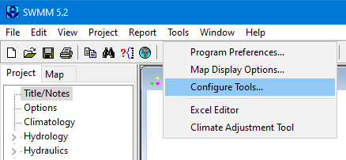
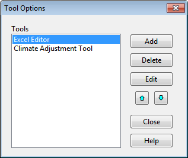
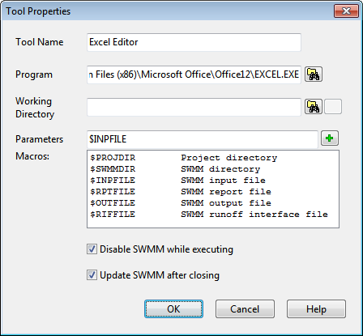

12.2 **Configuring Add-In Tools ** To configure one’s personal collection of add-in tools, select **Configure Tools** from the **Tools** menu. This will bring up the Tool Options dialog as shown below. The dialog lists the currently available tools and has command buttons for adding a new tool and for deleting or editing an existing tool. The up and down arrow buttons are used to change the order in which the registered tools are listed on the **Tools** menu.

Whenever the **Add** or **Edit** button is clicked on a the Tool Properties dialog will appear. This dialog is used to describe the properties of the new tool being added or the existing tool being edited.

The data entry fields of the Tool Properties dialog consist of the following: **Tool Name **

This is the name to be used for the tool when it is displayed in the Tools Menu. **Program **

Enter the full path name to the program that will be launched when the tool is selected. You can

click the button to bring up a standard Windows file selection dialog from which you can search for the tool’s executable file name. **Working Directory **

This field contains the name of the directory that will be used as the working directory when the

tool is launched. You can click the button to bring up a standard directory selection dialog from which you can search for the desired directory. You can also enter the macro symbol **$PROJDIR** to utilize the current SWMM project’s directory or **$SWMMDIR** to use the directory where the SWMM 5 executable resides. Either of these macros can also be inserted into the Working Directory field by selecting its name in the list of macros provided on the dialog and then

clicking the button. This field can be left blank, in which case the system’s current directory will be used. **Parameters **

This field contains the list of command line arguments that the tool’s executable program expects to see when it is launched. Multiple parameters can be entered as long as they are separated by spaces. A number of special macro symbols have been pre-defined, as listed in the Macros list box of the dialog, to simplify the process of listing the command line parameters. When one of these macro symbols is inserted into the list of parameters, it will be expanded to its true value when the tool is launched. A specific macro symbol can either be typed into the Parameters field or be selected from the Macros list (by clicking on it) and then added to the parameter list by clicking

the button. The available macro symbols and their meanings are:

**$PROJDIR ** The directory where the current SWMM project file resides.

**$SWMMDIR ** The directory where the SWMM 5 executable is installed.

**$INPFILE ** The name of a temporary file containing the current project’s data that is created just before the tool is launched.

**$RPTFILE ** The name of a temporary file that is created just before the tool is launched and can be displayed after the tool closes by using the **Report** >> **Status** command from the main SWMM menu.

**$OUTFILE ** The name of a temporary file to which the tool can write simulation results in the same format used by SWMM 5, which can then be displayed after the tool closes in the same fashion as if a SWMM run were made.

**$RIFFILE ** The name of the Runoff Interface File, as specified in the Interface Files page of the Simulation Options dialog, to which runoff simulation results were saved from a previous SWMM run (see Sections 8.1 and 11.7).

As an example of how the macro expansion works, consider the entries in the Tool Properties dialog shown previously. A Spreadsheet Editor tool will launch Microsoft Excel and pass it the name of the SWMM input data file to be opened by Excel. SWMM will issue the following command line to do this

**C:\Program Files (x86)\Microsoft Office\Office12\EXCEL.EXE ** **$INPFILE **

where the string **$INPFILE** will be replaced by the name of the temporary file that SWMM

creates internally that contains the current project’s data.

**Disable SWMM while executing **

Check this option if SWMM should be hidden and disabled while the tool is executing. Normally you will need to employ this option if the tool produces a modified input file or output file, such as when the **$INPFILE** or **$OUTFILE** macros are used as command line parameters. When this option is enabled, SWMM’s main window will be hidden from view until the tool is terminated.

**Update SWMM after closing **

Check this option if SWMM should be updated after the tool finishes executing. This option can only be selected if the option to disable SWMM while the tool is executing was first selected. Updating can occur in two ways. If the **$INPFILE** macro was used as a command line parameter for the tool and the corresponding temporary input file produced by SWMM was updated by the tool, then the current project’s data will be replaced with the data contained in the updated temporary input file. If the **$OUTFILE** macro was used as a command line parameter, and its

corresponding file is found to contain a valid set of output results after the tool closes, then the contents of this file will be used to display simulation results within the SWMM workspace.

Generally speaking, the suppliers of third-party tools will provide instructions on what settings should be used in the Tool Properties dialog to properly register their tool with SWMM.